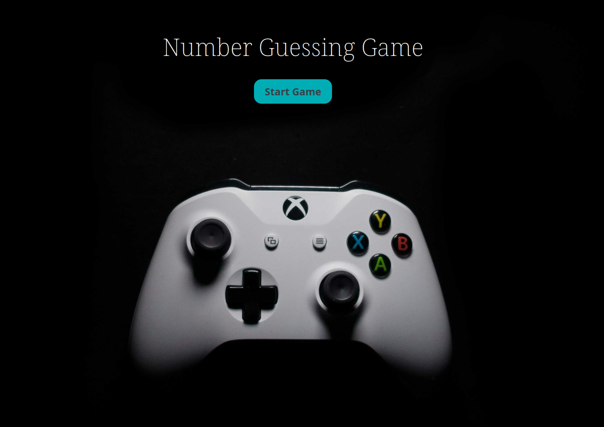

# Number Guessing Game

Simple browser-based game written in HTML, CSS and JavaScript.

[Demo](https://guessnumbergamebobbyandkyaw.netlify.app/)

## Project Description

This is a classic number guessing game where the computer randomly selects a number between 1 and 100 and the player tries to guess it. After each try, the player receives feedback whethere the guess was too low or too high or correct.

## Installation & Usage

To install and play that game

1. `git clone git@github.com:Kyaw1280/Hackathon_Bobby_Kyaw.git`

2. cd Game_1

3. Open `index.html` file on live server and enjoy the game.

## Technologies

- HTML
- CSS
- JavaScript

## Process

- Started by writing some pseudo code to break down the logic.
- Began by writing the HTML for structure, then write the script.js.
- Define the `guessNumberGame`, and wrote the logic inside.
- Added CSS for styling.

## Testing

This project use jest testing frame work.

### Running Test

`npm test`
To install test dependicies
`npm install --save-dev jest jest-environment-jsdom`

## Wins & Challenges

### Wins

- Learned about prompt and alert methods.
- Learned how to work together on a project with git.
- Learned about CSS variables.
- Learned more about how to use do while loop.

### Challenges

- In the beginning of the project, we had a lot of issues with git.

## Future Features

- Add different difficulty levels for the game.
- Add sound and motion effects.
- Include high score system.
